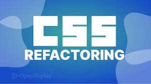

# portfolio

## Description
Started by greating an html and css, and added an images folder. Made an outline of what I wanted my portfolio to have in it on paper, and then built the outline accordinly in the html document. Modified the html and added specific things I wanted my portfolio to include. Made the CSS in accordance with the html.

## Sample Images

 
  
  

  ## Tech used
  * HTML
  * CSS

  ## Deployed App
 [ShelbyPortfolio] (https://github.com/ShelbyBennett/portfolio/settings/pages)

